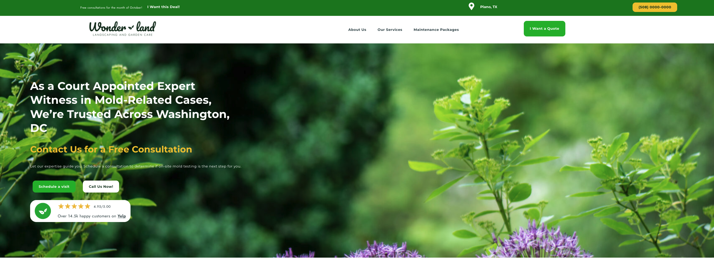
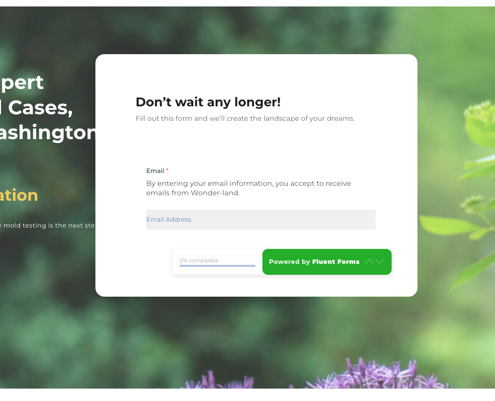

# Olly Olly Landing Page - WordPress Recreation

A pixel-perfect, fully responsive recreation of the original **Garden Care / Landscaping** mockup built with WordPress and Elementor.

The goal of this project was to faithfully replicate the design from the provided mockup, including all styles, typography, spacing, and the multi-step popup form, while ensuring excellent responsiveness across devices.

---

## Live Demo (Temporary)

**https://viviana-talismanic-undetrimentally.ngrok-free.dev**

> Note: This is a temporary URL via ngrok. The site may show a browser warning on first visit.

---

## Features

- **Pixel-perfect design** recreation from the original mockup
- Fully **responsive** layout (mobile, tablet, and desktop)
- Elegant multi-step popup form with smooth user experience
- Optimized performance with image lazy loading
- Clean, modern UI with attention to micro-details and hover effects
- Fast loading times and good SEO foundations

---

## Technologies & Stack

- **WordPress** 6.9.4 (updated to latest stable as of March 2026)
- **PHP** 8.2.29
- **Elementor** (main visual builder)
- **Popup Maker** – For the custom popup
- **Fluent Forms** – Multi-step form creation
- **WP Smush** – Image optimization & lazy load
- Additional Elementor add-ons and widgets as needed

---

## Project Goal

The main objective was to transform the original design mockup into a fully functional, responsive WordPress website while staying as close as possible to the original visuals and user flow.

Special attention was given to:
- Matching fonts, colors, spacing, and button styles
- Smooth animations and interactions
- Proper mobile experience
- Accurate multi-step consultation form

---

## Plugins Used

- **Elementor** – Primary page builder
- **Popup Maker** – Custom popup management
- **Fluent Forms** – Advanced multi-step form
- **WP Smush** – Image compression and lazy loading
- Additional supporting plugins for performance and styling

---

## Local Development

This project was developed using **LocalWP** (by Flywheel) with:
- Nginx server
- PHP 8.2
- Custom SSL setup via mkcert

---

## Screenshots

---

## Author

**Nelson Hernandez**

- Portfolio: https://github.com/nelsonhrj
- Contact: nelsonhrj@hotmail.com
---

## License

This project is for demonstration/portfolio purposes only.

---

Made using WordPress & Elementor
